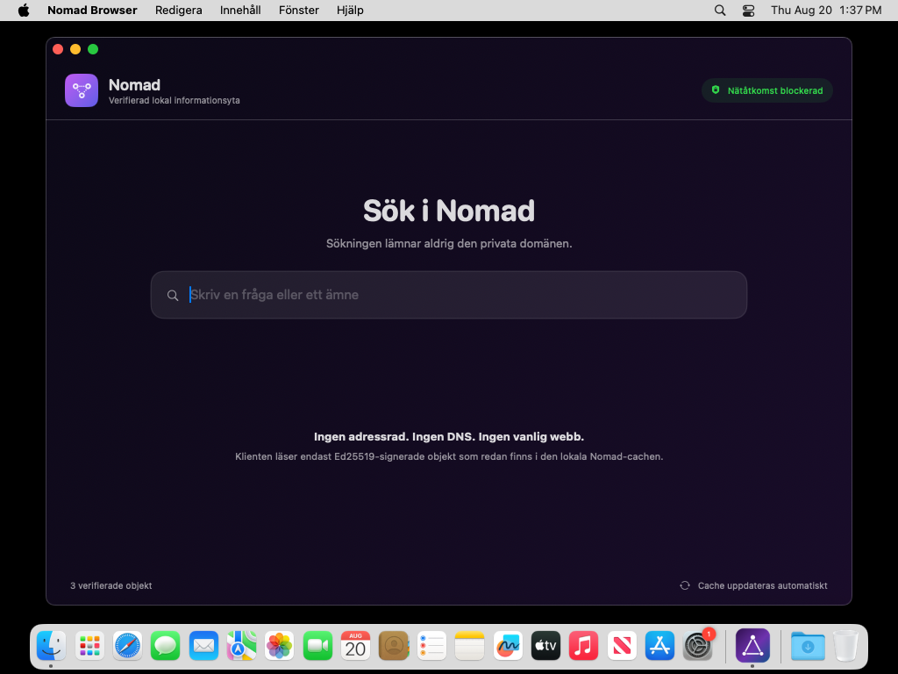

# Nomad Browser — real macOS CI capture

This image was produced by a GitHub-hosted macOS runner from the native SwiftUI
application built by `macos/scripts/build_dmg.sh`. The workflow launched the
resulting `.app` and used macOS `screencapture`; it is not a mockup or generated
product rendering.

The adjacent `Nomad-Browser-macOS.txt` records the source commit, macOS runner
version, launched process ID and SHA-256 digest of the PNG.

This screenshot is a visual/product artifact only. It is **not** evidence for
Nomad's anonymity or traffic-analysis claims.
